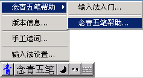

# 念青五笔86版·输入法

		

	

		
         

        <table border="0" cellpadding="0" cellspacing="0" width="100%" align="left">
  <tr>
    <td width="100%" valign="top" align="left">
          <table width="100%" border="1" bordercolor="#FFFFCC">
            <tr> 
              <td align="center"><table border="0" cellpadding="0" cellspacing="0">
                    <tr> 
                      <td valign="top">
　　 

                          念青五笔输入法是一个遵循五笔编码规则的中文输入法，包括有简体和繁體、86版和98版五笔编码等不同版本，适用于多种中文Windows操作系统。与坊间流行的众多五笔输入法相比，念青五笔在沿袭了系统输入法的简洁风格之余，更是悉数收藏了大量常用的GBK汉字（如冇、咁、啫、乜、嘢、啰、啲等）；其次，在避免重码的前提下，加入了大量词目，诸如非典、网友、程式、菜鸟、男色等，不一而足；此外，对码表中的词序排列也依据常用频率作出了适当调整，这使得输入中文时需要用到数字键选择备选词的机率大为减少，从而极大的提高了工作效率和滋润了休闲的心情。 
                          <table border="0" align="right">
                          <tr>
                            <td></td>
                          </tr>
                        </table>
                        
　　一个输入法，最重要的是能够输入尽可能多的汉字，免得在使用的时候捉襟见肘；再者啦，词汇要多，重码要少，为着减少重码率，一些无关紧要的词宁可不要，要不然也就体现不了五笔的妙处了。这两个，便一直是念青五笔的努力方向。

                        
　　念青输入法分别提供了86版五笔和98版五笔两种五笔编码规则，并有分别适用于简体中文版Windows 9x/ME及Windows 
                          2000/NT/XP的众多版本，安装前请留意版别，安装时需要用户取得系统管理员权限。

                        
　　如用户有特殊的需要（例如不宜安装或不想安装，却又想要暂时使用一下念青五笔），可以点击试用：<a href="nqwb/nqwbweb.htm" target="_blank">念青五笔在线版</a>（注：在线版大小约为627KB）。

                        
　　以下是分别适用于简体中文（Simplified Chinese）Windows 9x/ME和Windows NT/2000/XP/2003的念青五笔简/繁GB输入法（86版）。

                        <table border="1" align="center">
                          <tr class="toptitlenew">
                            <td>念青五笔简/繁体输入法（86版）  Windows All </td>
                            <td>软件大小</td>
                            <td>
版本特征词
</td>
                          </tr>
                          <tr class="font2">
                            <td class="toptitlenew"><a href="nqwb/soft/Nqwb86.exe">念青五笔86版 for Windows All （64bit）3.0.0.0</a></td>
                            <td class="toptitlenew">2.62 MB</td>
                            <td rowspan="2">

                                
打野（jayo）

                                
更新日期：2026/10/09

                            
</td>
                          </tr>
                          </table>
                        
&nbsp;

                        
　　<strong>其它版本</strong>：<a href="nqwb/nqwb98.htm" class="toptitlenew">念青五笔98版简繁体输入法 for 简体中文Windows操作系统</a>

                        
　　<strong>其它版本</strong>： <a href="nqwb/big5nqwb.htm" class="toptitlenew">念青五筆86、98版輸入法 for 繁體中文（Traditional Chinese）Windows作業系统</a> 

                        
　　<strong>其它版本</strong>： <a href="nqwb/nqlinux.htm" class="toptitlenew">念青五笔86版 for Linux</a> 

                        
　　用户在使用时遇到字词不够、不当的地方，或有任何其它意见，烦请加入念青五笔QQ群（群号码：7709014）提出，以便本输入法能够得以不断完善，非常感谢。

                         
</td>
                    </tr>
                  </table>
</td></tr>
          </table>		  </td> 
          <td width="60" valign="top" align="left"></td> 
  </tr> 
</table>
	    
        
        

	  

		

	

		<h5>Views</h5>

        <ul>
          <li class="selected"><a href="./" title="访问当前页面 [c]" accesskey="c">首页</a></li>
          <li ><a href="nqwb/" title="念青五笔输入法 [w]" accesskey="w">念青五笔</a></li>
          <li id="ca-viewsource"><a href="nqwb/help.htm" title="念青五笔帮助系统 [h]" accesskey="h">帮助系统</a></li>
          <li id="ca-history"><a href="nqwb/thanks.htm" title="特别鸣谢名单 [m]" accesskey="m">特别鸣谢</a></li>
          <li id="ca-viewsource"><a href="nqwb/skill.htm" title="念青五笔输入法技巧 [j]" accesskey="j">输入法相关技巧</a></li>
          <li id="ca-viewsource"><a href="nqwb/links.htm" title="输入法相关工具网站链接 [n]" accesskey="n">相关工具和网站链接</a></li>
          <li id="ca-viewsource"><a href="#" title="念青留言簿 [g]" accesskey="g">到此一游</a></li>
        </ul>
      

      

	

		<h5>Personal tools</h5>
		

		

	

	

		
	

	

	  

		

	

	
	

		<h5>&nbsp;</h5>
	  

	          	
      
        
       

		       
        
      

	

		

			

			

      

      版权所有 1998-2025 <a href="nianqing.htm" style="text-decoration: none" target="_top">念青</a>
      保留全部权利

      Copyright &copy;1998-2025
      <a href="http://www.nianqing.net/" target="_blank">念青小筑</a>All Rights Reserved

		

